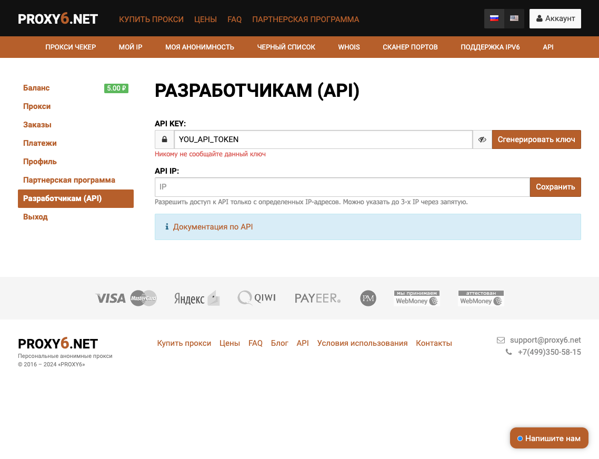

# Proxy6.net API

Простая и удобная реализация API для сервиса [proxy6.net](https://proxy6.net/?r=596657), с помощью которой можно автоматизировать работу с прокси.

### Установка
`@vicimpa/proxy6-api`
```bash
> npm install @vicimpa/proxy6-api -S
```

### Использование
```js
import { Proxy6Api } from "@vicimpa/proxy6-api";
const proxy6api = new Proxy6Api('YOU_API_TOKEN');
```

## !!! Внимание !!!
> Пилил всё это дело в ручную по достаточно кривенькой [документации](https://proxy6.net/developers?r=596657). Если будут какие-либо траблы или уточнения, ищите контакты у меня на [странице GitHub](https://github.com/vicimpa) 

### Перед началом

Для работы нужен ключ. Для его получения нужно перейти и зарегистрироваться на [proxy6.net](https://proxy6.net/?r=596657). Авторизоваться и подтвердить почту. После авторизации Вам нужно будет сгенерировать `API_KEY` в личном кабинете. Перейдите по ссылке [proxy6.net/user/developers](https://proxy6.net/user/developers?r=596657) и нажмите кнопочку сгенерировать ключ.

> 

### Методы API

* `getprice` - Получение информации о сумме заказа;
* `getcount` - Получение информации о доступном кол-ве прокси для конкретной страны;
* `getcountry` - Получение списка доступных стран;
* `getproxy` - Получение списка ваших прокси;
* `settype` - Изменение типа (протокола) прокси;
* `setdescr` - Обновление технического комментария;
* `buy` - Покупка прокси;
* `prolong` - Продление списка прокси;
* `delete` - Удаление прокси;
* `check` - Проверка валидности прокси.
* `ipauth` - Привязка/удаление авторизации прокси по ip.

Буквально в каждом ответе на методы будет присутствовать следующая структура, поэтому далее её не описываю:

```ts
{
  status: 'yes' // Всегда "yes";
  user_id: string // Номер вашего аккаунта;
  balance: string // Текущее состояние вашего баланса;
  currency: string // Валюта вашего аккаунта (RUB, либо USD).
}
```

Любая ошибка с API выдаст исключение:
```ts
class Proxy6Error {
  id: number; // id ошибки
  message: string; // короткое сообщение
  description(): string; // полное описание ошибки
}
```

### Метод "getprice"
Используется для получения информации о сумме заказа в зависимости от версии, периода и кол-ва прокси.
##### Параметры
```ts
{
  /** (Обязательный) - Кол-во прокси; */
  count: number;
  /** (Обязательный) - Период - кол-во дней; */
  period: number;
  /** Версия прокси: 4 - IPv4, 3 - IPv4 Shared, 6 - IPv6 (по-умолчанию). */
  version?: number;
}
```
#### Результат
```ts
{
  price: number; // Итоговая стоимость;
  price_single: number; // Стоимость одного прокси;
  period: number; // Запрошенный период (кол-во дней);
  count: number; // Запрошенное кол-во прокси.
}
```

### Метод "getcount"
Используется для получения информации о доступном для приобретения кол-ве прокси определенной страны.
##### Параметры
```ts
{
  /** (Обязательный) - Код страны в формате iso2; */
  country: string;
  /** Версия прокси: 4 - IPv4, 3 - IPv4 Shared, 6 - IPv6 (по-умолчанию). */
  version?: number;
}
```
#### Результат
```ts
{
  count: number; // Доступное кол-во.
}
```

### Метод "getcountry"
Используется для получения информации о доступных для приобретения странах.
##### Параметры
```ts
{
  /** Версия прокси: 4 - IPv4, 3 - IPv4 Shared, 6 - IPv6 (по-умолчанию). */
  version?: number;
}
```
#### Результат
```ts
{
  list: string[]; // Массив доступных стран в формате iso2.
}
```

### Метод "getproxy"
Используется для получения списка ваших прокси.
##### Параметры
```ts
{
  /** Состояние возвращаемых прокси. Доступные значения: active - Активные, expired - Неактивные, expiring - Заканчивающиеся, all - Все (по-умолчанию); */
  state?: 'active' | 'expired' | 'expiring' | 'all';
  /** Технический комментарий, который вы указывали при покупке прокси. Если данный параметр присутствует, то будут выбраны только те прокси, у которых присутствует данный комментарий, если же данный параметр не задан, то будут выбраны все прокси; */
  descr?: string;
  /** При установке данного параметра в `true`, список list будет возвращаться массивом `Array` иначе `Record` */
  nokey?: NoKey;
  /** Номер страницы для вывода. 1 - по-умолчанию; */
  page?: number;
  /** Кол-во прокси для вывода в списке. 1000 - по-умолчанию (максимальное значение). */
  limit?: number;
}
```
#### Результат
```ts
{
  list_count: number; // Кол-во прокси (на странице);
  list: Array<ProxyItem> | Record<string | ProxyItem> // Список прокси. Тип зависит от `nokey`;
}
```
##### ProxyItem
```ts
{
  id: string; // Внутренний номер прокси, необходим для продления срока действия - метод prolong
  ip: string; // IPv4, либо IPv6 скрытый за host:port - зависит от версии прокси;
  host: string; // IPv4;
  port: string; // Порт;
  user: string; // Логин;
  pass: string; // Пароль;
  type: string; // Тип прокси: http - HTTPS, socks - SOCKS5;
  date: string; // Дата покупки прокси;
  date_end: string; // Дата окончания срока действия прокси;
  unixtime: number; // Дата покупки прокси;
  unixtime_end: number; // Дата окончания срока действия прокси;
  active: string; // Активный (1) или нет (0).
  country: string; // Страна (iso2);
  descr: string; // Технический комментарий;
}
```

### Метод "settype"
Используется для изменения типа (протокола) у списка прокси.
##### Параметры
```ts
{
  /** (Обязательный) - Перечень внутренних номеров прокси в нашей системе; */
  ids: number | number[];
  /** (Обязательный) - Устанавливаемый тип (протокол): http - HTTPS, либо socks - SOCKS5. */
  type: 'http' | 'socks';
}
```
##### Результат стандартный
```ts
{
  status: 'yes' // Всегда "yes";
  user_id: string // Номер вашего аккаунта;
  balance: string // Текущее состояние вашего баланса;
  currency: string // Валюта вашего аккаунта (RUB, либо USD).
}
```

### Метод "setdescr"
Используется для обновления технического комментария у списка прокси, который был установлен при покупке (метод `buy`).
##### Параметры
Важно понимать, что тут обязательные `new` и один из `old` и `ids`
```ts
{
  /** (Обязательный) - Технический комментарий, на который нужно изменить. Максимальная длина 50 символов; */
  new: string;
  /** Технический комментарий, который нужно изменить; */
  old: string;
  /** Перечень внутренних номеров прокси в нашей системе. */
  ids: number | number[];
}
```
##### Результат
```ts
{
  count: number // Кол-во прокси у которых был изменен комментарий.
}
```

### Метод "buy"
Используется для покупки прокси.
##### Параметры
```ts
{
  /** (Обязательный) - Кол-во прокси для покупки; */
  count: number;
  /** (Обязательный) - Период на который покупаются прокси - кол-во дней; */
  period: number;
  /** (Обязательный) - Страна в формате iso2; */
  country: string;
  /** Версия прокси: 4 - IPv4, 3 - IPv4 Shared, 6 - IPv6 (по-умолчанию); */
  version?: number;
  /** Тип прокси (протокол): socks, либо http (по-умолчанию); */
  type?: 'http' | 'socks';
  /** Технический комментарий для списка прокси, максимальная длина 50 символов. Указание данного параметра позволит вам делать выборку списка прокси про этому параметру через метод getproxy */
  descr?: string;
  /** При добавлении данного параметра (значение не требуется), у купленных прокси будет включено автопродление; */
  auto_prolong?: boolean;
  /** При установке данного параметра в `true`, список list будет возвращаться массивом `Array` иначе `Record`. */
  nokey?: NoKey;
}
```
##### Результат
```ts
{
  count: number; // Запрошенное кол-во прокси для покупки;
  price: number; // Итоговая стоимость;
  period: number; // Запрошенный период для покупки (кол-во дней);
  country: string; // Локация (страна) прокси для покупки в формате iso2;
  list: Array<ProxyItemBuy> | Record<string | ProxyItemBuy> // Список прокси. Тип зависит от `nokey`;
}
```
##### ProxyItemBuy
```ts
{
  id: string; // Внутренний номер прокси, необходим для продления срока действия - метод prolong
  ip: string; // IPv4, либо IPv6 скрытый за host:port - зависит от версии прокси;
  host: string; // IPv4;
  port: string; // Порт;
  user: string; // Логин;
  pass: string; // Пароль;
  type: string; // Тип прокси: http - HTTPS, socks - SOCKS5;
  date: string; // Дата покупки прокси;
  date_end: string; // Дата окончания срока действия прокси;
  unixtime: number; // Дата покупки прокси;
  unixtime_end: number; // Дата окончания срока действия прокси;
  active: string; // Активный (1) или нет (0).
}
```

### Метод "prolong"
Используется для продления текущих прокси.
##### Параметры
```ts
{
  /** (Обязательный) - Период продления - кол-во дней; */
  period: number;
  /** (Обязательный) - Перечень внутренних номеров прокси в нашей системе; */
  ids: number | number[];
  /** При установке данного параметра в `true`, список list будет возвращаться массивом `Array` иначе `Record`. */
  nokey?: boolean;
}
```
##### Результат
```ts
{
  price: number; // Итоговая стоимость продления;
  period: number; // Запрошенный период для продления (кол-во дней);
  count: number; // Кол-во успешных продлений;
  list: Array<ProxyItemProlong> | Record<string | ProxyItemProlong> // Список прокси. Тип зависит от `nokey`;
}
```
##### ProxyItemProlong
```ts
{
  id: string; // Внутренний номер прокси, необходим для продления срока действия - метод prolong
  date_end: string; // Дата окончания срока действия прокси;
  unixtime_end: number; // Дата окончания срока действия прокси;
}
```

### Метод "delete"
Используется для удаления прокси.
##### Параметры
Учтите, что обязательно должен присутствовать один из параметров, либо `ids`, либо `descr`.
```ts
{
  /** (Обязательный) - Перечень внутренних номеров прокси в нашей системе; */
  ids: number | number[];
  /** (Обязательный) - Технический комментарий, который вы указывали при покупке прокси, либо через метод setdescr. */
  descr: string;
}
```
##### Результат
```ts
{
  count: number // Кол-во удаленных прокси.
}
```

### Метод "check"
Используется для проверки валидности (работоспособности) прокси.
##### Параметры
```ts
{
  /** (Обязательный) - Внутренний номер прокси в нашей системе. */
  ids: number | number[];
}
```
##### Результат
```ts
{
  proxy_id: number; // Внутренник номер прокси;
  proxy_status: boolean; // Результат проверки: true или false.
}
```

### Метод "ipauth"
Используется для привязки, либо удаления авторизации прокси по ip.
##### Параметры
```ts
{
  /** (Обязательный) - Список привязываемых ip-адресов, либо "delete" -  для удаления привязки. */
  ip: string | string[] | 'delete';
}
```
##### Результат стандартный
```ts
{
  status: 'yes' // Всегда "yes";
  user_id: string // Номер вашего аккаунта;
  balance: string // Текущее состояние вашего баланса;
  currency: string // Валюта вашего аккаунта (RUB, либо USD).
}
```